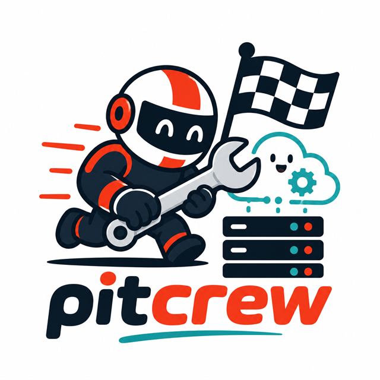

<p align="center">
  
</p>

<h1 align="center">PitCrew</h1>

<p align="center"><strong>Fresh GitHub Actions runners for every job.</strong></p>

<p align="center">
  <a href="https://github.com/ncosentino/pitcrew/actions/workflows/ci.yml"></a>
  <a href="https://github.com/ncosentino/pitcrew/actions/workflows/docs.yml"></a>
  <a href="LICENSE"></a>
</p>

PitCrew orchestrates profile-driven pools of isolated, ephemeral GitHub Actions
runners on any machine with Docker. Each worker accepts one job, is destroyed,
and is immediately replaced with a clean container.

## Why PitCrew

- **Fresh worker per job:** cancelled builds, partial installs, and workspace
  debris disappear with the container.
- **Named runner profiles:** keep general-purpose CI capacity separate from
  browser, evaluation, or other specialized toolchains.
- **Exact routing:** mandatory profile labels prevent broad `self-hosted` jobs
  from consuming specialized workers.
- **Independent pools:** each profile has its own manager, image, state file,
  Compose project, capacity, and cleanup boundary.
- **In-place capacity changes:** add slots immediately or drain removed slots
  after their current runner exits without restarting the manager.
- **Repository, organization, and enterprise scope:** dedicate workers to
  repositories or share capacity through supported GitHub scopes.
- **No credentials in images:** registration state stays in gitignored local
  files; workload credentials belong in GitHub Actions secrets.

## Security boundary

PitCrew's manager mounts the host Docker socket so it can create worker
containers. The workers do not receive that socket. Run PitCrew only on a
dedicated host you trust, and never route untrusted fork pull requests to
self-hosted runners.

## Quick start

Requirements:

- Docker with Linux-container support
- PowerShell 7
- An authenticated GitHub CLI session, or a fine-grained PAT with runner
  administration access

```powershell
git clone https://github.com/ncosentino/pitcrew.git
Set-Location pitcrew

# One general-purpose worker for a repository.
.\Setup-Runner.ps1 -Repos https://github.com/you/project

# Different capacity per repository.
.\Setup-Runner.ps1 -Repos `
    https://github.com/you/project-a=2,`
    https://github.com/you/project-b=4
```

The default profile keeps GitHub's standard `self-hosted`, `linux`, and
architecture labels and adds `general-purpose`.

```yaml
jobs:
  build:
    runs-on: [self-hosted, linux, x64, general-purpose]
```

## Named profiles

Named profiles isolate specialized workers from routine CI. PitCrew includes a
checksum-verified `copilot-cli` profile as a complete example:

```powershell
.\Setup-Runner.ps1 `
    -Profile copilot-cli `
    -Repos https://github.com/you/agentic-project=2
```

```yaml
jobs:
  evaluate:
    runs-on: [linux, x64, copilot-cli]
    steps:
      - uses: actions/checkout@v6
      - name: Run evaluation
        env:
          COPILOT_GITHUB_TOKEN: ${{ secrets.COPILOT_GITHUB_TOKEN }}
        run: copilot --version
```

Specialized profiles omit the broad `self-hosted` label by default, so routine
jobs cannot consume their capacity accidentally.

## How it works

```text
Setup-Runner.ps1
        |
        +-- static profile environment (token, image, labels, scope)
        +-- atomic desired-capacity state
        +-- credential-free lifecycle and resource projection
        |
        v
profile manager (Docker socket)
        |
        +-- desired slot -> docker run --rm -> one job -> replace
        +-- draining slot -> current docker run exits -> stop
```

One lightweight manager runs per profile. Worker containers are siblings on the
host Docker daemon rather than nested containers. Reapplying setup with only
worker-count changes updates mounted state in place; image, label, scope,
runner-group, and naming changes retain full profile replacement.

The manager also samples host capacity and current manager and worker CPU,
memory, and PID usage into the observed-state projection. Connectors and
dashboards remain read-only consumers and never receive the Docker socket.

Manager stop and restart send `SIGTERM` to all profile workers concurrently so
compatible runner images can deregister from GitHub before their containers are
removed. Exact-label force removal remains a bounded fallback for workers that
do not exit.

## Copilot CLI operations plugin

Install PitCrew's marketplace plugin to give Copilot repeatable workflows for
capacity changes, PitCrew release updates, and hosted dashboard updates:

```powershell
copilot plugin marketplace add ncosentino/pitcrew
copilot plugin install pitcrew-operations@pitcrew
```

The plugin invokes `Setup-Runner.ps1` and scoped Docker Compose commands. It
does not add a remote control plane, pre-approve shell commands, restart the
Docker daemon, or perform host-wide cleanup.

See the
[Copilot CLI operations guide](https://www.devleader.ca/projects/pitcrew/guides/copilot-operations)
for skill names, examples, and safety behavior.

## Documentation

Full setup, profile, routing, security, and troubleshooting guidance is
available at [www.devleader.ca/projects/pitcrew](https://www.devleader.ca/projects/pitcrew).

## Contributing

1. Open an issue describing the change or problem.
2. Keep changes focused and include contract coverage for behavior changes.
3. Run `pwsh tests/Test-RunnerProfiles.ps1` and
   `pwsh tests/Test-CopilotPlugin.ps1` before opening a pull request.

## About

PitCrew is built by [Nick Cosentino](https://www.devleader.ca), creator of
[Dev Leader](https://www.devleader.ca) and
[BrandGhost](https://www.brandghost.ai).

## License

PitCrew is available under the [MIT License](LICENSE).
