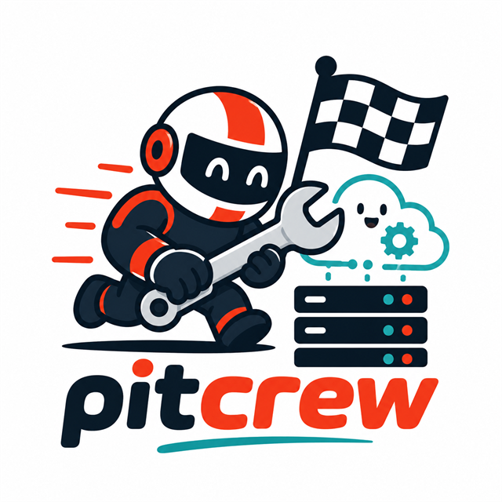

# PitCrew

<p align="center">
  
</p>

PitCrew orchestrates containerized GitHub Actions runners that are destroyed
after one job and replaced when fixed capacity or current demand requires
another. It is designed for teams and individual
developers who want self-hosted capacity without carrying workspace state or
partially installed tools between jobs.

## Installation

Clone the public repository onto a dedicated Docker host:

```powershell
git clone https://github.com/ncosentino/pitcrew.git
Set-Location pitcrew
```

PitCrew requires PowerShell 7 and Docker with Linux-container support.

## Quick example

Start two general-purpose workers for one repository:

```powershell
.\Setup-Runner.ps1 `
    -Repos https://github.com/you/project=2
```

Route a workflow job to that pool:

```yaml
jobs:
  build:
    runs-on: [self-hosted, linux, x64, general-purpose]
```

## Why it exists

Long-lived self-hosted workers accumulate state: interrupted package installs,
modified global tools, cached credentials, and stale workspaces can affect later
jobs. PitCrew keeps lightweight manager containers alive while replacing the
actual workers after every job.

Named profiles also let one host provide separate capacity for routine builds
and specialized workloads without allowing broad `self-hosted` jobs to consume
the specialized pool.

Optional demand-driven profiles retain only a configured idle floor and use
GitHub runner scale-set demand to return toward their operator-defined maximum.

## Documentation map

- [Getting Started](getting-started.md) installs the first profile and routes a
  workflow.
- [Configuration](configuration.md) defines setup parameters, profile manifests,
  generated state, and manager contracts.
- [Host-Local Admission Operations](guides/host-admission.md) explains policy
  calibration, rollout, diagnostics, and rollback.
- [Troubleshooting](troubleshooting.md) diagnoses registration, routing, capacity,
  image, and Docker failures.
- [Building from Source](building.md) identifies local validation entry points.
- [Documentation Deployment](deployment.md) defines the canonical site and Pages
  indexing boundary.
- [Guides](guides/index.md) cover profiles, routing, autoscaling, updates, security,
  services, external data, and Copilot operations.
- [Contributor Architecture](contributing/architecture.md) maps implementation
  boundaries and executable contracts.
- [Agent Guidance](contributing/agent-guidance.md) explains guidance ownership,
  review, and context budgets.
- [Architecture Decision Records](adr/README.md) preserve significant decisions.

## About

PitCrew is built by [Nick Cosentino](https://www.devleader.ca). Follow
[Dev Leader](https://www.devleader.ca) for software engineering articles and
videos, and [BrandGhost](https://www.brandghost.ai) for social-first updates.
